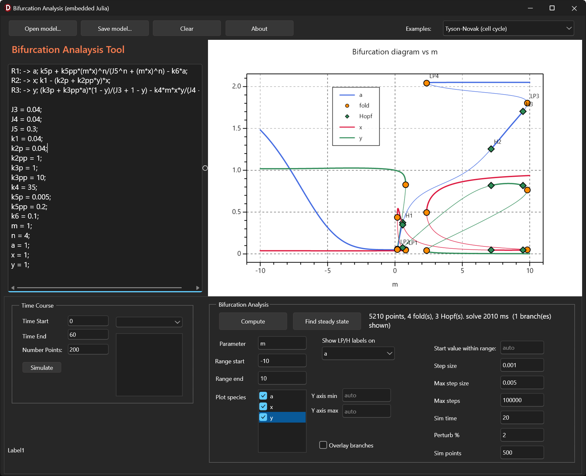
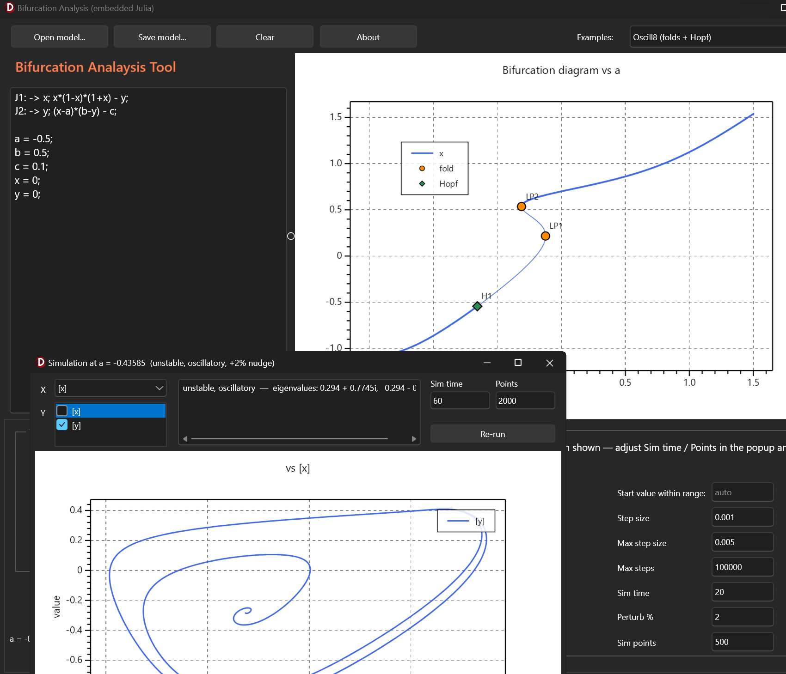
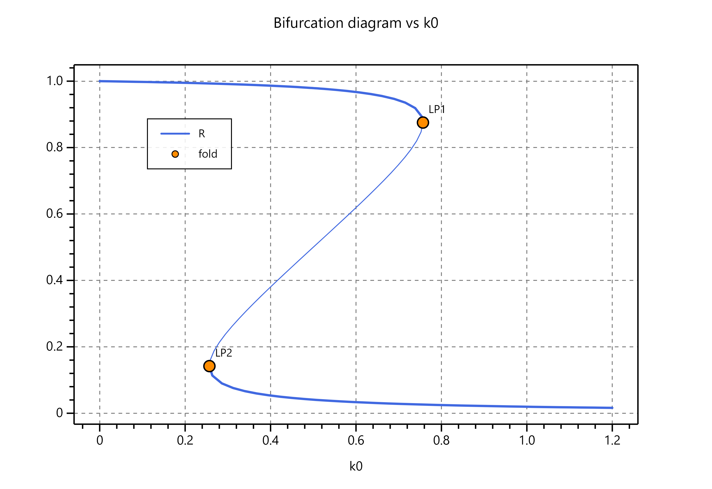

# BifurcationTool

A Windows desktop application for **bifurcation analysis** of biochemical / ODE models. You write a
model in [Antimony](https://tellurium.readthedocs.io/en/latest/antimony.html), compute a bifurcation
diagram, and click points on the diagram to run time-course and phase-plane simulations.

---

## System requirements

- **Windows 10 or 11 (64-bit)**
- **Julia 1.12.6** (installed via `juliaup` — see below). The app uses Julia internally for the
  continuation calculations; everything else is native.
- ~2 GB free disk space (the Julia runtime payload is large). Internet access is needed **once**, to
  download Julia itself — nothing else is fetched.

## Screenshots

 &nbsp; 

<p align="center">

</p>

---

## Installation

### 1. Unzip the application

Unzip the download to any folder you like, for example `C:\Apps\BifurcationTool`. Keep the folder
structure intact — `BifurcationTool.exe` must stay next to the `julia\` folder.

### 2. Install Julia (juliaup)

The app needs Julia, installed through **juliaup** (the official Julia version manager). Use **one**
of these two methods.

**Option A — MSIX App Installer (easiest).** Open this link and let Windows' App Installer run:

<https://install.julialang.org/Julia.appinstaller>

Windows will open an installer window and ask you to confirm — click **Install** and let it finish.

**Option B — winget.** In a PowerShell window (step 3 shows how to open one), run:

```
winget install --name Julia --id 9NJNWW8PVKMN -e -s msstore
```

Both install the same thing and put `juliaup` and `julia` on your PATH automatically.

> **Expect a few prompts — none of them indicate a problem.** The first time you use winget with the
> Microsoft Store source, it asks you to review and accept the source agreements: answer **`Y`** and
> press **Enter**. You may also see the install location or package terms displayed for
> confirmation, and a progress bar while it downloads. This is all normal — it is Windows' standard
> software-installation process, and Julia is being fetched from Microsoft's own Store.

Either way, **step 3 below is still required** — it selects the Julia version this app needs, and
that part does need a PowerShell window.

> ### ⚠️ Do NOT use the "manual download" installers
>
> The Julia website also offers **Manual Downloads** — standalone `.exe` installers (and portable
> archives) for one specific Julia version. **Do not use those for this app.**
>
> Those installers do not set up juliaup, and this app locates Julia through juliaup's records. If
> you install Julia manually, the app will report **"Julia was not found"** even though Julia is
> installed and `julia --version` works perfectly well in PowerShell — a confusing failure that
> is easy to waste time on.
>
> Use Option A or Option B above. If you have *already* installed Julia manually and would rather
> not reinstall, see **"Julia was not found" (manual install)** under Troubleshooting.

### 3. Install the exact Julia version this app needs

**This app requires Julia 1.12.6.** A different version will not work (the app will tell you if
there's a mismatch).

**Open PowerShell:** press the **Windows key**, type `powershell`, and press **Enter**. A window
opens with a prompt like `PS C:\Users\<you>>`. (PowerShell is built into every Windows 10 and 11
machine — there is nothing to install. On Windows 11 it may open inside "Windows Terminal"; that's
the same thing and works fine.)

Type the following line and press **Enter**. It downloads Julia 1.12.6 — this takes a minute or two
and prints progress as it goes. Wait until the prompt (`PS C:\Users\<you>>`) reappears before
continuing:

```
juliaup add 1.12.6
```

Then type this line and press **Enter**. It makes that version the one this app will use, and
finishes immediately:

```
juliaup default 1.12.6
```

Verify, in the same PowerShell window:

```
julia --version
```

should print `julia version 1.12.6`.

**That's the end of the command-line part.** If you saw `julia version 1.12.6`, close the PowerShell
window — click the **X** in its top-right corner, or type `exit` and press **Enter**. You won't need
it again; everything from here on is done in the application itself.

If it printed a *different* version number, or said `julia` is not recognized, don't close the
window — see [Troubleshooting](#troubleshooting) below.

### 4. Run

Double-click **`BifurcationTool.exe`**. On first launch it starts Julia in the background; the status
bar shows "Engine warm — Press Compute." when it's ready (typically about a second after the very
first, slightly slower, start).

---

## Quick start

1. Pick a model from the **Examples** dropdown (top-right), or type/paste your own Antimony model.
2. Set the **parameter** to vary and its **min/max** range.
3. Tick the **species** you want plotted.
4. Press **Compute**. The bifurcation diagram appears; thick lines are stable branches, thin lines
   unstable. Fold (LP) and Hopf (H) points are marked.
5. **Click a point** on a branch to run a simulation at that state (time-course / phase-plane popup).
6. Use **Clear** to wipe the editor and plot and start fresh.

Model files (with their analysis settings) can be saved and reopened with **Save** / **Open**.

---

## Troubleshooting

- **"Julia was not found."** — Julia isn't installed via juliaup. Do steps 2–3 above, then reopen
  the app.
- **"Julia was not found" (manual install)** — if `julia --version` works in PowerShell but the
  app still can't find it, you almost certainly installed Julia with a **manual download** rather
  than juliaup (see the warning in step 2). Either:
  - **Recommended:** uninstall that Julia and reinstall via Option A or B in step 2; or
  - set the environment variable **`JULIA_BINDIR`** to the `bin` folder holding `libjulia.dll` (for
    example `C:\Users\<you>\AppData\Local\Programs\Julia-1.12.6\bin`), then reopen the app. The
    version must still be exactly 1.12.6.
- **`juliaup` is not recognized** — the installer places `juliaup`/`julia` in
  `%LOCALAPPDATA%\Microsoft\WindowsApps`, which is normally on your PATH. If it isn't found, open a
  new PowerShell window; if it still fails, check Settings → Apps → Advanced app settings → **App execution
  aliases** and make sure the Julia entries are on. On locked-down/corporate machines that block the
  Microsoft Store, ask your IT department, as the manual installer is not supported (see step 2).
- **"This build needs Julia 1.12.6, but the installed default is X."** — Run
  `juliaup add 1.12.6` then `juliaup default 1.12.6`, and reopen the app.
- **Compute fails or the engine never warms up** — check that `julia --version` reports 1.12.6, and
  that the `julia` folder sits next to `BifurcationTool.exe` with the unzip intact.
- The app still opens for editing even when Julia isn't ready; only the bifurcation **Compute** and
  steady-state features are disabled until it is.

Everything the app needs beyond Julia itself is included in the download — there are no packages to
install and nothing to configure.

### Reporting a problem

The app writes a short startup log every time it runs. If it won't start, or closes immediately,
please send that file — it records exactly how far startup got.

**Easiest way to find it:** press the **Windows key**, type or paste the line below, and press
**Enter**. An Explorer window opens containing **`startup.log`** — attach that file to your report.

```
%LOCALAPPDATA%\BifurcationTool
```

(You can also paste that same line into the address bar of any Explorer window.)

**The actual location**, if you prefer to navigate there yourself, is:

```
C:\Users\<your username>\AppData\Local\BifurcationTool\startup.log
```

Note that **`AppData` is a hidden folder**, so you won't see it just by browsing to your user
folder. Either use the paste method above, or turn on *View → Show → Hidden items* in Explorer.
